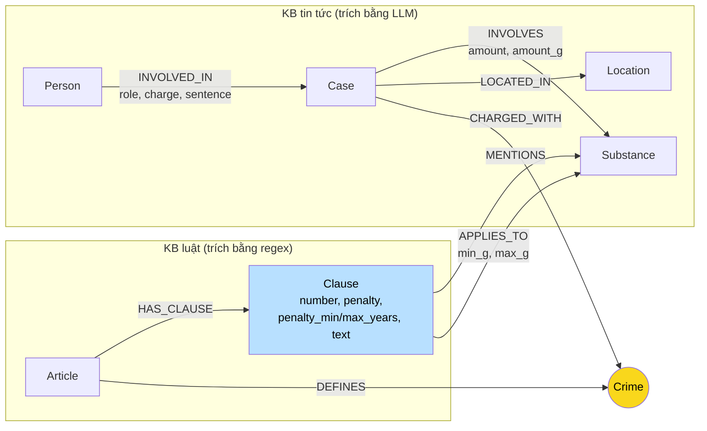

# Thiết kế Ontology — Day 19

**Họ tên:** Nguyễn Hồng Phi  **MSSV:** 2A202602750

**Lựa chọn** (đánh dấu một):
- [ ] Dùng ontology gợi ý (có thể chỉnh nhỏ)
- [x] Tự thiết kế (xét bonus +15, xem `SUBMISSION.md`)

> Xuất phát từ ontology gợi ý, tôi **sửa lại có chủ đích 4 điểm** sau khi hoàn thành lab trên ontology gợi ý và tự tìm thấy lỗi của nó (chi tiết và bằng chứng trước/sau ở mục 7, đầy đủ hơn ở `REPORT_KG.md` mục 3). Sản phẩm chạy được toàn bộ: code trong `src/graph.py`, graph thật trong Neo4j (199 nodes / 529 cạnh), `--check` đủ `[OK]`, benchmark đầy đủ trong `ket_qua_benchmark_kg.txt`; kết quả của ontology gợi ý để so sánh ở `ket_qua_benchmark_kg.hint.txt`.

## 1. Sơ đồ

**Node cầu nối vẫn là `Crime`**; phần tự thiết kế nằm ở **`Clause`** (node được tô xanh): thay vì giữ ngưỡng khối lượng dưới dạng chữ trong `text`, tôi tách thành **cạnh `APPLIES_TO {min_g, max_g}` có khoảng số**, và thêm **`penalty_min_years/penalty_max_years`** cho khung hình phạt.

## 2. Entity types (node labels)

| Label | Ý nghĩa | Khóa định danh (`MERGE` theo) | Properties | Lấy từ KB nào | Trích bằng (regex / LLM / khác) |
| --- | --- | --- | --- | --- | --- |
| `Article` | Một Điều luật | `id` ("Điều 251 BLHS") | id, title, law, doc_id | Luật | Regex |
| `Clause` | Một khoản luật, **có cấu trúc hóa ngưỡng + khung phạt** | `id` ("Điều 250 BLHS khoản 4") | id, number, penalty, **penalty_min_years, penalty_max_years**, text, doc_id | Luật | Regex (tách khoản, parse khung phạt và khoảng gam) |
| `Crime` | **Tội danh chuẩn — node cầu nối** | `name` chuẩn hóa | name | Cả hai | Luật: regex từ tiêu đề; tin: LLM + `link_entity` |
| `Substance` | Chất ma túy, **có cờ `canonical`** | `name` | name, **canonical** (true/false, null = từ phía luật) | Cả hai | Luật: regex; tin: LLM → `link_substance` (alias + fuzzy) |
| `Case` | Vụ việc trong tin | `name` (LLM đặt, fallback tiêu đề) | name, summary, date, doc_id, source_title | Tin | LLM |
| `Person` | Người trong vụ án | `name` (+ `aliases` bắt biệt danh) | name, aliases | Tin | LLM |
| `Location` | Tỉnh/thành phố | `name` | name | Tin | LLM |

`doc_id` gắn cho node sinh từ **một** tài liệu (Article, Clause, Case); Crime, Substance, Person, Location dùng chung nhiều tài liệu nên không có — đúng hợp đồng của lab (node luật/tin vẫn có `doc_id` để nối chunk vector).

## 3. Relationships

| Type | Từ → Đến | Properties trên cạnh | Ý nghĩa |
| --- | --- | --- | --- |
| `DEFINES` | Article → Crime | — | Điều luật định nghĩa tội danh |
| `HAS_CLAUSE` | Article → Clause | — | Điều gồm các khoản |
| `MENTIONS` | Clause → Substance | — | Khoản nhắc tới chất (không kèm ngưỡng, vd khoản 1 liệt kê chất của khung cơ bản) |
| **`APPLIES_TO`** | Clause → Substance | **min_g, max_g (số, gam; max_g null = "trở lên")** | **Ngưỡng khối lượng làm khoản đó tăng khung** — tách từ text luật bằng regex, vd khoản 4 Điều 250: MDMA min_g=100 |
| `CHARGED_WITH` | Case → Crime | — | Vụ án bị truy tố/bắt về tội gì — cạnh cầu nối |
| `INVOLVED_IN` | Person → Case | role, charge, sentence | Ai liên quan vụ nào, vai trò, tội danh, mức án |
| `INVOLVES` | Case → Substance | amount, **amount_g (số, gam)** | Vụ liên quan chất gì, khối lượng (chuỗi gốc + số chuẩn hóa) |
| `LOCATED_IN` | Case → Location | — | Vụ xảy ra ở đâu |

## 4. Node cầu nối giữa 2 KB

- **Node nào:** `Crime` (giữ nguyên từ gợi ý — đây là lựa chọn đúng nên không đổi).
- **Vì sao:** tội danh tồn tại bắt buộc ở cả hai phía, và là tập đóng nhỏ (13 tên) chuẩn hóa được gần tuyệt đối bằng regex phía luật + `link_entity` (chuẩn hóa → khớp chính xác → difflib cutoff 0.8 → None nếu không giống) phía tin. Chất ma túy thì tên gọi trong báo chí rất lộn, không đáng tin làm cầu.
- **Cách đảm bảo hai phía khớp tên:** phía luật 100% regex từ tiêu đề "Tội X"; prompt LLM được nhúng danh sách 13 tội chuẩn và bị bắt buộc chọn nguyên văn; output vẫn ép qua `link_entity` lần nữa. V2 bổ sung: chất ma túy cũng được ép qua `link_substance` (alias "thuốc lắc"→MDMA, "ma túy đá/tổng hợp"→Methamphetamine… rồi mới fuzzy), chất nào không khớp thì vẫn tạo node nhưng gắn `canonical=false` để **phân biệt được** với chất chuẩn thay vì trộn lẫn.
- **Khi nào cầu gãy, và bạn xử lý thế nào:** bài tin không nêu tội danh thuộc Chương XX (rửa tiền cho băng đảng Sinaloa, "phát hiện nghi vấn" chưa khởi tố) → `link_entity` trả None, Case không nối sang luật — chấp nhận gãy có kiểm soát vì nối sai còn tệ hơn. Cầu bằng chất là đường phụ (Case–INVOLVES–Substance–MENTIONS–Clause) và v2 làm nó đáng tin hơn nhờ canonical hóa.

## 5. Competency questions

| Câu | Đường đi (Cypher pattern) | Trả lời được? |
| --- | --- | --- |
| Q1 | (chunk `pcmt-dieu-2` từ vector search) → `(:Article {id:'Điều 2 Luật PCMT'})-[:HAS_CLAUSE]->(:Clause {number:4})` | Được (judge 2) |
| Q2 | `(:Person)-[:INVOLVED_IN {sentence:'tử hình'}]->(:Case)` | Được (judge 2) |
| Q3 | `(:Person {name:'Lê Minh Thành'})-[:INVOLVED_IN {sentence:'36 tháng tù'}]->(:Case)-[:CHARGED_WITH]->(:Crime)<-[:DEFINES]-(:Article {id:'Điều 251 BLHS'})-[:HAS_CLAUSE]->(:Clause {number:1})` | Được (judge 2; Flat 0) |
| Q4 | Đường như Q3 tới `(:Article {id:'Điều 255 BLHS'})`, rồi **quy tắc mới: câu hỏi chứa "tối đa" → `RETURN top 1 Clause ORDER BY penalty_max_years DESC`** → khoản 4 ("tù chung thân") | **Được** — ontology gợi ý trả sai (bỏ sót khoản 4, recall 0.00, judge 0); v2 recall 1.00, judge 2 |
| Q5 | `(:Case)-[:INVOLVES {amount_g:9600}]->(:Substance {name:'MDMA'})<-[:APPLIES_TO {min_g:100}]-(:Clause {number:4})` — **so khoảng số trực tiếp trên graph** | **Được, không cần LLM đọc text** — khoản 4 được chọn bằng phép so `9600 >= min_g AND (max_g IS NULL)`, và ngữ cảnh có cả dòng giải thích ngưỡng (judge 2) |
| Q6 | `(Case)-[:INVOLVES]->(:Substance {name:'MDMA'})` | Được — recall 1.00 (đủ 3 tên trong gold) nhờ các vụ "thuốc lắc"/"MDMA" gom về đúng node MDMA; judge 1 vì câu trả lời liệt kê dư 1 vụ trùng |

## 6. Quyết định thiết kế và đánh đổi

1. **Ngưỡng khối lượng thành cạnh `APPLIES_TO {min_g, max_g}` (số), không để dạng chữ trong `text`.** Phương án khác: giữ nguyên như gợi ý (chữ) và để LLM tự đọc text khoản. Tôi tách bằng regex vì text luật cực đều ("từ X gam đến dưới Y gam", "X gam trở lên") — 220 khoảng từ 18 điều, chi phí bằng 0; đổi lại KG-3 trả lời Q5 kiểu số `amount_g ≥ min_g` ngay trên graph. Đánh đổi: parser chỉ hiểu được các mẫu khoảng chuẩn, các trường hợp chữ kiểu "nhiều lần hơn khung thấp nhất" không tách được.
2. **`penalty_min_years/penalty_max_years` với quy ước chung thân=99, tử hình=100.** Phương án khác: không mô hình hóa, hoặc dùng node Penalty riêng. Tôi chọn property số trên Clause để có thể `ORDER BY penalty_max_years DESC` — điều khoản nào khung cao nhất là một phép sort, mở đường trả lời mọi câu "mức tối đa" (Q4). Đánh đổi: 99/100 là proxy quy ước (ghi rõ ở đây), không dùng để tính toán pháp lý thật.
3. **Chất trích từ tin ép qua `link_substance` (alias + fuzzy) và gắn cờ `canonical`.** Phương án khác: tin getName gì tạo node đó (gợi ý), hoặc gạch hẳn chất không khớp. Tôi chọn gộp những cái có alias đã biết (thuốc lắc→MDMA…) và **giữ + đánh dấu** cái không khớp (`canonical=false`: "etomidate", "nước vui"…) vì xóa bỏ mất thông tin (bài pod chill quả thật là etomidate — chất ngoài danh mục luật), trong khi cờ giúp truy vấn phân biệt `MATCH (s:Substance {canonical: false})` — trước đây không phân biệt được.
4. **Thứ tự ngữ cảnh trong KG-3: dữ kiện có nội dung (tóm tắt vụ, text khoản, ngưỡng) đứng trước, cạnh chỉ-tên đứng cuối và bị cắt trước khi vượt `max_facts`.** Phương án khác: giữ thứ tự gợi ý (seed 1-hop trước). Tôi đảo vì trên ontology gợi ý, 60 cạnh tên từ 3 điều luật từng chiếm sạch `max_facts=60` và đẩy Điều 255 ra khỏi prompt (E2, bằng chứng ở REPORT mục 3); đảo thứ tự là sửa 1 dòng, không tốn thêm token.
5. **Luật regex — tin LLM (giữ như gợi ý).** Văn bản luật đều và deterministic; tin là văn xuôi. Đánh đổi: toàn bộ lỗi trùng/lệch thực thể dồn về phía LLM, nên v2 mới cần canonical hóa chất (quyết định 3).

## 7. So với ontology gợi ý (bắt buộc nếu xét bonus)

| Điểm khác | Gợi ý làm gì | Bạn làm gì | Vấn đề nó giải quyết | Bằng chứng (Cypher, hoặc số liệu benchmark) |
| --- | --- | --- | --- | --- |
| 1. Ngưỡng khối lượng `APPLIES_TO {min_g, max_g}` + `INVOLVES.amount_g` | Ngưỡng nằm lẫn trong `Clause.text` dạng chữ; việc chọn khoản theo khối lượng phó thác cho LLM đọc text khi sinh câu trả lời | Regex tách khoảng gam từ text luật (220 cạnh từ 18 điều, 0 token) và chuẩn hóa `amount` chuỗi thành `amount_g` số ("hơn 9,6 kg"→9600.0); KG-3 khớp khoản bằng `amount_g >= min_g AND (max_g IS NULL OR amount_g < max_g)` và sinh dòng giải thích ngưỡng | Câu cross-kb-multi-hop theo khối lượng (Q5) chọn được khoản **bằng số trên graph**, không phụ thuộc LLM tự đọc; đường đi minh bạch, kiểm chứng được | Trước (hint): Q5 đúng nhưng chỉ nhờ LLM trích cả chunk luật. Sau (v2): `MATCH (k)-[:INVOLVES]->(s)<-[:APPLIES_TO {min_g:100}]-(:Clause {number:4})` trúng khoản 4 Điều 250 cho amount_g=9600; câu trả lời Q5 v2 dẫn "thuộc ngưỡng **100 g trở lên** tại **điểm b khoản 4 Điều 250**" — recall 1.00, judge 2 |
| 2. `Clause.penalty_min_years / penalty_max_years` (chung thân=99, tử hình=100) | Không có; mọi khoản ngang giá trị | Regex parse khung phạt thành khoảng năm (53/99 khoản có giá trị); khi câu hỏi chứa "tối đa/cao nhất/chung thân/tử hình", KG-3 lấy `top 1 Clause ORDER BY penalty_max_years DESC` của từng Điều đi tới được | Sửa đúng lỗi E2: câu hỏi mức phạt tối đa (Q4) trước đây chỉ lấy được khoản 1 vì bộ lọc "khoản 1 hoặc khoản nhắc chất" bỏ sót khoản 4 (Điều 255 không nhắc chất nào) | Trước: Q4 recall 0.00 / judge 0 (`ket_qua_benchmark_kg.hint.txt`: "graph chỉ nêu Điều 249 và Điều 250… không liên hệ Hoàng Nato"). Sau: Q4 recall **1.00** / judge **2** — trả lời "Mức cao nhất của Điều 255 là **tù chung thân** theo khoản 4" (`ket_qua_benchmark_kg.txt`) |
| 3. Chất tin tức qua `link_substance` (alias + fuzzy) + cờ `Substance.canonical` | Tên chất LLM viết gì thì `MERGE` node đó — "thuốc lắc", "ma túy tổng hợp" thành node riêng, không gộp, không phân biệt với chất chuẩn | Alias map + `link_substance` gộp về tên chuẩn; không gộp được thì giữ node nhưng `canonical=false` | Giảm trùng thực thể (E3) và **truy vấn được** nhóm chất chưa chuẩn hóa thay vì trộn lẫn | Trước: 17 Substance, gồm 'thuốc lắc', 'ma túy tổng hợp', 'ma túy tổng hợp các loại', 'Chất ma túy nghi vấn'… không gì phân biệt được. Sau: 15 Substance; `thuốc lắc`/`ma túy đá` đã gộp về MDMA/Methamphetamine; `MATCH (s:Substance {canonical:false})` trả về đúng các node chưa chuẩn ('etomidate', 'nước vui', 'ma túy các loại'…) |
| 4. Thứ tự ngữ cảnh KG-3: text khoản trước, cạnh seed sau | `seed_facts` (cạnh 1-hop chỉ có tên) đứng đầu, dễ chiếm hết `max_facts=60` | Ghép lại: tóm tắt vụ → text khoản → ngưỡng → cạnh seed; cắt phần cạnh seed khi tràn | Đúng lỗi "tràn max_facts" của E2: khi vector search trả toàn chunk luật, 60 cạnh tên từng đẩy mọi text khoản ra khỏi prompt | Trước (hint): tái lập `context()` cho Q4 với doc_ids luật → 60 facts toàn cạnh tên, 0 text khoản. Sau (v2): cùng truy vấn → 60 facts bắt đầu bằng tóm tắt vụ + text khoản 1–4 của Điều 249/251/255, có "chung thân" |

**Ontology mới trả lời được câu mà gợi ý trả lời sai/thiếu:** Q4 (mức phạt tối đa — gợi ý sai hoàn toàn, v2 đúng đủ); Q5 (gợi ý đúng "may mắn" nhờ LLM, v2 đúng bằng suy luận số trên graph — minh bạch và kiểm chứng được).

## 8. Hạn chế còn lại

- `Case`, `Person` vẫn khóa theo tên LLM tự đặt: cùng một sự kiện có thể thành 2 node (đã thấy 2 Case "Phú Quốc ngày 25-9/27-9" từ cùng một bài). Khóa ổn định cần số vụ án/CCCD — KB không có; hướng sửa là khử trùng lặp theo `doc_id` + so summary.
- Parser ngưỡng chỉ hiểu các mẫu khoảng chuẩn trong BLHS Chương XX; ngưỡng dạng chữ khác ("nhiều lần hơn khung thấp nhất") không tách được.
- Proxy chung thân=99/tử hình=100 chỉ phục vụ xếp hạng, không phải giá trị pháp lý.
- Vẫn phụ thuộc LLM phía tin tức: 2 lần chạy v2 cho số node lệch nhẹ (203 vs 199) do tên Case/Person do LLM đặt; cờ `canonical` giảm hậu quả nhưng không eliminare.
- Giai đoạn tố tụng (bắt/khởi tố/truy tố/xét xử) chưa mô hình hóa — `role`/`charge`/`sentence` vẫn ghi lẫn các giai đoạn.
