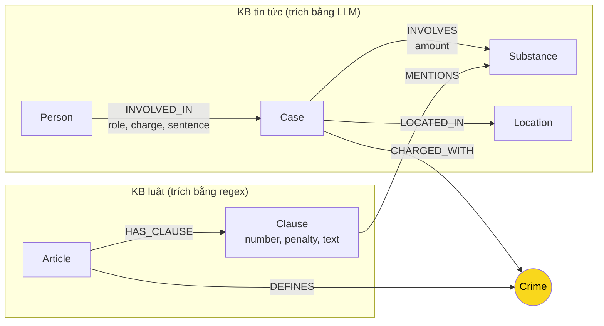

# Thiết kế Ontology — Day 19

**Họ tên:** Nguyễn Hồng Phi  **MSSV:** 2A202602750

**Lựa chọn** (đánh dấu một):
- [x] Dùng ontology gợi ý (có thể chỉnh nhỏ)
- [ ] Tự thiết kế (xét bonus +15, xem `SUBMISSION.md`)

> Tôi đi con đường ontology gợi ý (các hàm HINT trong `src/graph.py`) vì vòng đời tội danh là một tập đóng, nhỏ (13 tội trong Chương XX BLHS), rất phù hợp làm node cầu nối; các hàm trích xuất regex cho luật cũng tận dụng được trọn vẹn. Mọi nội dung dưới đây được tôi viết lại bằng lời của mình và **khớp với graph thật** đang có trong Neo4j: 202 node (Article 18, Clause 99, Crime 13, Substance 17, Case 16, Person 32, Location 7) và 379 cạnh (MENTIONS 169, HAS_CLAUSE 99, INVOLVED_IN 40, INVOLVES 25, CHARGED_WITH 19, LOCATED_IN 14, DEFINES 13) — đã đối chiếu với ảnh `report/img/kg_count.png`.

## 1. Sơ đồ

**Node cầu nối là `Crime`** (vòng tròn vàng): luật định nghĩa tội qua `DEFINES`, vụ án trong tin bị truy tố "tội đó" qua `CHARGED_WITH`.

## 2. Entity types (node labels)

| Label | Ý nghĩa | Khóa định danh (`MERGE` theo) | Properties | Lấy từ KB nào | Trích bằng (regex / LLM / khác) |
| --- | --- | --- | --- | --- | --- |
| `Article` | Một Điều luật | `id` ("Điều 251 BLHS", "Điều 2 Luật PCMT") | id, title, law, doc_id | Luật | Regex (front-matter + tiêu đề) |
| `Clause` | Một khoản của Điều | `id` ("Điều 251 BLHS khoản 1") | id, number, penalty, text, doc_id | Luật | Regex (tách theo `^1. `…) |
| `Crime` | **Tội danh chuẩn — node cầu nối** | `name` (đã chuẩn hóa, vd "mua bán trái phép chất ma túy") | name | Cả hai | Luật: regex từ tiêu đề "Tội …"; tin: LLM rồi `link_entity` về tên chuẩn |
| `Substance` | Chất ma túy | `name` (danh sách chuẩn `SUBSTANCES` + tên LLM tự đặt) | name | Cả hai | Luật: regex (`find_substances`); tin: LLM |
| `Case` | Một vụ việc trong tin | `name` (LLM đặt, fallback = tiêu đề bài) | name, summary, date, doc_id, source_title | Tin | LLM |
| `Person` | Người trong vụ án | `name` (+ `aliases` để bắt biệt danh như "Hoàng Nato") | name, aliases | Tin | LLM |
| `Location` | Tỉnh/thành phố | `name` | name | Tin | LLM |

Vì sao khóa là `name`/`id`: đây là các "thứ của thế giới thực" xuất hiện ở nhiều tài liệu; `MERGE` theo khóa giúp cùng một tội/chất/người từ nhiều bài gom về một node. Node sinh ra từ **một** tài liệu duy nhất (Article, Clause, Case) mang thêm `doc_id` theo hợp đồng của lab; các node dùng chung (Crime, Substance, Person, Location) cố tình không gắn `doc_id` vì thuộc nhiều tài liệu cùng lúc.

## 3. Relationships

| Type | Từ → Đến | Properties trên cạnh | Ý nghĩa |
| --- | --- | --- | --- |
| `DEFINES` | Article → Crime | — | Điều luật định nghĩa tội danh |
| `HAS_CLAUSE` | Article → Clause | — | Điều gồm các khoản |
| `MENTIONS` | Clause → Substance | — | Khoản luật liệt kê chất với ngưỡng khối lượng (vd "MDMA … 100 gam trở lên") |
| `CHARGED_WITH` | Case → Crime | — | Vụ án bị truy tố/bắt về tội gì — **cạnh cầu nối từ tin sang luật** |
| `INVOLVED_IN` | Person → Case | role, charge, sentence | Ai liên quan vụ nào, vai trò, tội danh riêng, mức án |
| `INVOLVES` | Case → Substance | amount | Vụ án liên quan chất gì, khối lượng bao nhiêu |
| `LOCATED_IN` | Case → Location | — | Vụ xảy ra ở đâu |

## 4. Node cầu nối giữa 2 KB

- **Node nào:** `Crime`, qua hai cạnh `CHARGED_WITH` (từ tin) và `DEFINES` (từ luật).
- **Vì sao chọn node này:** tội danh là thuộc tính **bắt buộc phải có ở cả hai phía** — một Điều trong Chương XX luôn định nghĩa đúng một tội (regex lấy được 100%, deterministic), còn một vụ án tin tức hầu như luôn nêu tội danh. Quan trọng hơn, tập tên tội là **tập đóng, nhỏ (13 tên)** nên chuẩn hóa được gần như tuyệt đối; trong khi nếu lấy `Substance` làm cầu nối thì tên chất trong báo chí rất lộn (biệt danh, tên lóng), tỉ lệ khớp thấp.
- **Cách đảm bảo hai phía khớp tên:** (1) phía luật, tên tội lấy thẳng từ tiêu đề "Tội X" rồi đưa qua `normalize_crime` (chữ thường, bỏ tiền tố "tội", gọn khoảng trắng) — đây là **bộ tên chuẩn**; (2) prompt LLM được nhúng sẵn DANH SÁCH TỘI DANH và bắt buộc chọn nguyên văn; (3) dù vậy, output LLM vẫn được ép qua `link_entity` lần nữa: chuẩn hóa cả hai phía → khớp chính xác → không thì `difflib.get_close_matches` với cutoff 0.8 (bắt được biến thể "ma tuý"/"ma túy") → vẫn không giống thì trả `None`, **không nối bừa**.
- **Khi nào cầu gãy, và bạn xử lý thế nào:** gãy khi (a) bài tin không nêu tội danh đúng nghĩa (bài "phát hiện nghi vấn", bài rửa tiền cho băng đảng Sinaloa — tội không nằm trong Chương XX) → `link_entity` trả None, Case không có cạnh `CHARGED_WITH`, đúng ra **không nên** nối; (b) LLM đặt tội danh quá lệch so với danh sách chuẩn → bị rớt ở cutoff 0.8. Cách xử lý hiện tại là chấp nhận gãy có kiểm soát (an toàn hơn nối sai) và đưa vào danh sách chuẩn các biến thể thường gặp; trong graph thật có 5/16 Case không nối được sang luật (soi thêm ở REPORT_KG.md mục 3, lỗi E1).

## 5. Competency questions

Đường đi trên graph cho từng câu trong `data/benchmark_kg.json`:

| Câu | Đường đi (Cypher pattern) | Trả lời được? |
| --- | --- | --- |
| Q1 | (chunk của `pcmt-dieu-2` qua vector search) → `(:Article {id:'Điều 2 Luật PCMT'})-[:HAS_CLAUSE]->(:Clause {number:4})`, định nghĩa "tiền chất" nằm trong `Clause.text` | Được — text khoản luật có sẵn định nghĩa; GraphRAG còn trích dẫn đúng "khoản 4 Điều 2 Luật PCMT" (judge = 2) |
| Q2 | `(:Person)-[r:INVOLVED_IN {sentence:'tử hình'}]->(:Case {name:'Vụ mua bán hơn 36kg ma túy tại TP.HCM'})` trả về Trần Thanh Tuấn, Trần Minh Tâm | Được (judge = 2) |
| Q3 | `(:Person {name:'Lê Minh Thành'})-[:INVOLVED_IN {sentence:'36 tháng tù'}]->(:Case)-[:CHARGED_WITH]->(:Crime)<-[:DEFINES]-(:Article {id:'Điều 251 BLHS'})-[:HAS_CLAUSE]->(:Clause {number:1, penalty:'phạt tù từ 02 năm đến 07 năm'})` | Được — chính là đường xuyên 2 KB; Flat RAG không trả lời được (recall 0.00), GraphRAG judge = 2 |
| Q4 | `(:Person {aliases:['Hoàng Nato']})-[:INVOLVED_IN]->(:Case)-[:CHARGED_WITH]->(:Crime {name:'tổ chức sử dụng trái phép chất ma túy'})<-[:DEFINES]-(:Article {id:'Điều 255 BLHS'})-[:HAS_CLAUSE]->(:Clause)` | **Một phần.** Đi được tới Điều 255 và khoản 1, nhưng khoản 4 ("tù 20 năm hoặc tù chung thân") bị bộ lọc khoản bỏ sót vì Điều 255 không nhắc chất cụ thể nào (chi tiết: REPORT_KG.md lỗi E2) |
| Q5 | `(:Person {name:'Cái Quang Huy'})-[:INVOLVED_IN]->(:Case)-[:INVOLVES {amount:'hơn 9,6 kg'}]->(:Substance {name:'MDMA'})` và `(Case)-[:CHARGED_WITH]->(:Crime)<-[:DEFINES]-(:Article {id:'Điều 250 BLHS'})-[:HAS_CLAUSE]->(:Clause {number:4})-[:MENTIONS]->(:Substance {name:'MDMA'})` | Được — khoản 4 được giữ nhờ điều kiện "khoản MENTIONS chất mà vụ INVOLVES"; judge = 2 |
| Q6 | `(Case)-[:INVOLVES]->(:Substance {name:'MDMA'})` — liệt kê Case kề node chất | **Một phần.** Các vụ mà LLM trích chất đúng tên "MDMA" gom về một node nên liệt kê được; nhưng các vụ bị trích thành "ma túy tổng hợp", "thuốc lắc"… tạo node Substance riêng, không gộp được (chi tiết: lỗi E3) |

## 6. Quyết định thiết kế và đánh đổi

1. **Mức án là property `sentence` trên cạnh `INVOLVED_IN`, không tách thành node `Penalty`.** Phương án khác: node Penalty nối tới Person/Case, query được "liệt kê mọi mức án đã tuyên". Tôi chọn property vì benchmark chỉ hỏi mức án của một người cụ thể; tách node làm graph phình thêm ~40 node + 40 cạnh và prompt dài hơn khi không cần. Đổi lại, không so sánh/truy vấn tập hợp mức án được trọn vẹn.
2. **Tách `Clause` thành node riêng thay vì giữ nguyên văn cả Điều trên `Article`.** Phương án khác: chỉ node Article mang full text — graph nhỏ hơn nhiều (bớt 99 node), prompt ngắn hơn. Tôi chọn tách khoản vì câu hỏi loại cross-kb đều quy về **khung hình phạt theo khoản** (Q5 cần đúng khoản 4 theo khối lượng MDMA); không tách khoản thì không lọc được, hoặc phải nhồi cả Điều dài vào prompt mỗi lần.
3. **Cầu nối là `Crime`, không phải `Substance`.** Phương án khác và vì sao không: xem mục 4 — tập tội danh đóng, chuẩn hóa được gần tuyệt đối; tên chất trong tin tức là "đại dương tên gọi" (`ma túy tổng hợp`, `thuốc lắc`, `Tinh thể rắn màu trắng nghi là chất ma túy`…) nên nếu lấy chất làm cầu nối thì tỉ lệ gãy rất cao. Đánh đổi: các câu hỏi đi bằng chất (Q6) phụ thuộc vào việc LLM trích đúng tên chuẩn, không còn bảo đảm bởi cơ chế cầu nối.
4. **Luật trích bằng regex, tin trích bằng LLM.** Văn bản luật cực đều (Điều → khoản → điểm, mẫu câu "thì bị phạt tù từ … đến …") nên regex rẻ, nhanh, chạy 100 lần ra một kết quả; tin tức là văn xuôi tự do nên bắt buộc LLM. Đánh đổi: phần LLM (~0,01 USD/lần dựng, không ổn định hoàn toàn giữa các lần chạy) là nguồn chính của các lỗi trùng/lech thực thể ở mục 3 báo cáo.

## 7. So với ontology gợi ý (bắt buộc nếu xét bonus)

Không xét bonus — dùng nguyên ontology gợi ý, không có thay đổi cấu trúc nào so với phần HINT trong `src/graph.py`.

## 8. Hạn chế còn lại

- **Định danh theo tên do LLM tự đặt** (`Case`, `Person`): cùng một sự kiện ngoài đời có thể thành 2 node (graph thật đã có "Vụ phát hiện bao tải… ngày 27-9" và "… ngày 25-9" sinh từ cùng một bài — xem E3). Khóa ổn định hơn cần nguồn ngoài văn bản (số vụ án, CCCD) mà KB không có.
- **`Substance` không gộp tên đồng nghĩa** ("thuốc lắc" ≈ MDMA/Amphetamine) và một số node là mô tả rác ("Chất ma túy nghi vấn").
- **Ngưỡng khối lượng không được mô hình hóa**: `INVOLVES.amount` là chuỗi ("hơn 9,6 kg"), còn ngưỡng nằm lẫn trong `Clause.text` ("100 gam trở lên") — hệ thống không tự so sánh được, phải nhờ LLM đọc text (và nhờ vậy Q5 mới đúng, nhưng đây là "lơi" của thiết kế).
- **Không phân biệt giai đoạn tố tụng** (bắt / khởi tố / truy tố / xét xử) — `role` và `charge` ghi lẫn cả nghi phạm chưa xét xử lẫn bị cáo đã tuyên án, nên cạnh `charge`/`sentence` rỗng ở một số vụ (E6).
- `Crime`, `Substance`, `Person`, `Location` không có `doc_id` (cố ý, vì dùng chung), nên không lần ra nguồn tài liệu trực tiếp từ node này.
